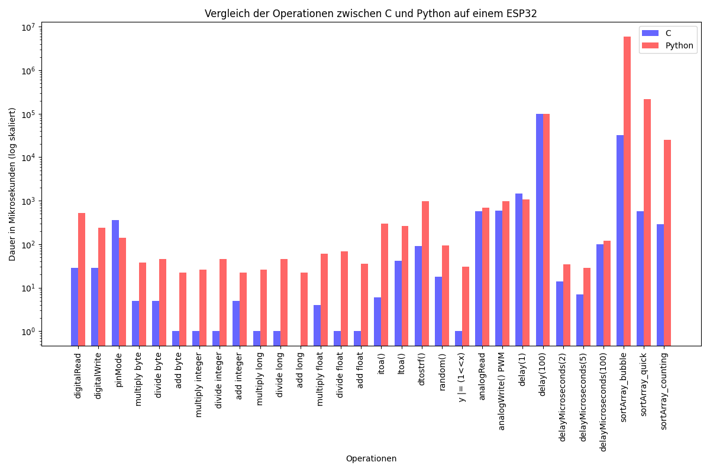

# ESP32 Performance Benchmark

This project aims to demonstrate the effectiveness and performance of various low-level programming operations on an ESP32 microcontroller using different programming languages.

## Operations Summary

The following operations were benchmarked (durations in microseconds):

- digitalRead
- digitalWrite
- pinMode
- multiply byte
- divide byte
- add byte
- multiply integer
- divide integer
- add integer
- multiply long
- divide long
- add long
- multiply float
- divide float
- add float
- itoa()
- ltoa()
- dtostrf()
- random()
- y |= (1<<x)
- analogRead
- digitalWrite() PWM
- delay(1)
- delay(100)
- delayMicroseconds(2)
- delayMicroseconds(5)
- delayMicroseconds(100)
- sortArray_bubble
- sortArray_quick
- sortArray_counting

## Performance Comparison Plot

The plot above illustrates the comparative performance of C and Python implementations across various operations on the ESP32.

### About the Plot

- The x-axis represents different operations.
- The y-axis represents the duration in microseconds (log scale).
- Blue bars indicate durations for C implementations.
- Red bars indicate durations for Python implementations.
